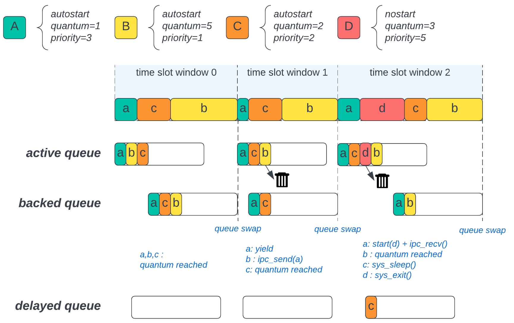
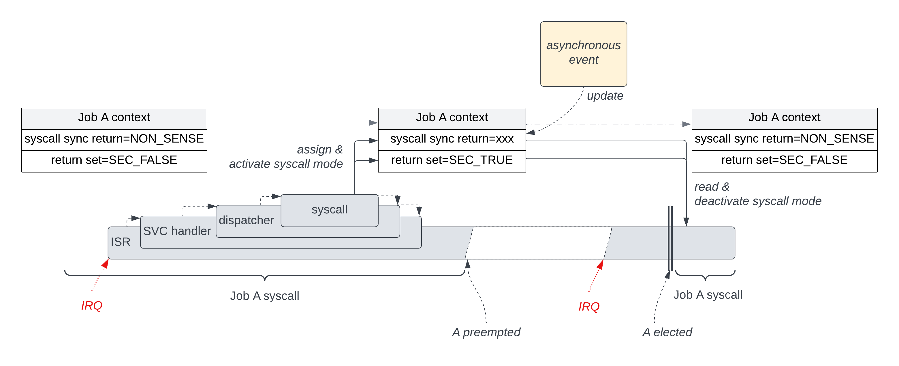

Sentry schedulers
-----------------

.. _schedulers:

Scheduling basics
^^^^^^^^^^^^^^^^^

Sentry schedulers all works with the very same API so that it is easy to substitute
a given scheduler with another one. Scheduling theory allows the usage of abstracted
API while the jobs metadata hold all the required informations for the selected scheduler.

The scheduler API is based on three main functions, shared by all schedulers.

Scheduling a job
""""""""""""""""

Scheduling a job means that the job id added to the current active scheduling queue
of the scheduler. This does not mean that the job is immediately scheduled, as the
job election is under the scheduler control.
This neither means that the currently being executed job is preempted. For example,
using the `sys_start()` syscall API do schedule a new job, but the current job is
not preempted by this syscall, and the next job will be elected using the updated
schedulable job list, at preemption (or termination, for FIFO scheduler) time.

.. literalinclude:: ../../../kernel/include/sentry/sched.h
  :language: c
  :lines: 31
  :caption: schedule function API definition

Electing a job
""""""""""""""

Electing a job happens at context switch time, when the current job is preempted or
terminated. The scheduler select the next job in its current list of schedulable job
using its own scheduling policy, and return the job identifier (through the `taskh_t`
handler). The effective context switching is not under the scheduler responsability,
it only returns the next eligible job based on its own policy to the caller, which
is responsible for such context switching.

.. literalinclude:: ../../../kernel/include/sentry/sched.h
  :language: c
  :lines: 42
  :caption: election function API definition

Delaying a job
""""""""""""""

A job can be delayed in order to be scheduler later on. This is typically the use
case of the `sys_sleep()` syscall. In that case, the job is not added to the scheduler
active queue but instead added to a separated, scheduler agnostic, delayed queue.

The time manager is responsible for detecting delay timeout, and scheduling the
job afterward. The delayed job is then scheduled, not elected, meaning that it is
not immediately executed but instead added to the current eligible job list of the
scheduler.

.. literalinclude:: ../../../kernel/include/sentry/managers/time.h
  :language: c
  :lines: 24
  :caption: delaying function API definition

Scheduling and job events
"""""""""""""""""""""""""

The job state is the consequence of its own (and other jobs) syscalls, and external events (interrupt).
This means that adding a job to the scheduler queue is under the responsability of all these
events managers (including syscalls).

As such, blocking syscalls such as IPC, Sleep, Exit... must update the job current state
**before** calling the `elect()` method of the scheduler, so that the scheduler can decide what
to do with the current job (keeping it or removing it).

For syscalls that have border effects on other jobs (IPC recv, start...), syscall implementation
is responsible for updating the target (or peer) job state accordingly **before** calling the
`schedule()` method of the scheduler.

In the very same way, when an interrupt rise that target a given job, the interrupt manager is
responsible to update the target job state accordingly (except if the job is in a waiting state
of another event such as IPC wait), and call the `schedule()` API afterward, if needed.

In case of job fault, the job is preempted by the fault handler, and its state is updated
accordingly before the `elect()` call.

Based on this behavior, at `elect()` time, any state that is not considered ready by the
selected scheduler automatically removes the job from the scheduler list.
`JOB_STATE_YIELDED` is scheduler-specific: it is treated as a ready-equivalent state in
RRMQ, while in RMA it defers job eligibility until the next period boundary.

Job termination and new job
"""""""""""""""""""""""""""

At job termination, the task manager is responsible for executing post-execution jobs
(see :ref:`job termination concepts <job_termination>`). As a consequence, the post-execution
job is then scheduled with the very same `taskh_t` value in the scheduler. Only the job
state differs, from active to terminating job.

RRMQ scheduler
^^^^^^^^^^^^^^

About RRMQ scheduling policy
""""""""""""""""""""""""""""

RRMQ (Round-Robin, Multi-queue with Quantum) scheduler is a scheduling policy
that supports two complementary properties from schedulable elements (jobs in
Sentry): **priority** and **quantum**.

   * the job **priority** defines the relative priority with which a job is selected
     in the current active job set. In Sentry, th higher the priority is, the faster
     the job is selected
   * the job **quantum** defines the duration of the job local execution period before
     being preempted by the scheduler.

RRMQ scheduler is using queue-based time slot windows (see below) using two queues:

   * an active queue, where jobs are elected
   * a backed queue, where jobs having consumed their quantum are pushed

All scheduled jobs are added to the active queue. Each job is successively
elected and executed with a duration upto the job quantum.

If the `elect()` API is called and the job is still ready, there are two possibilities:

   * the quantum is reached
   * the job voluntary yield

In both cases the scheduler behave the same and pushes the job to a secondary queue denoted
*backed queue*, where jobs that have consumed all their quantum are positioned. Doing
that, the job quantum is refill. This means that yielding jobs have their quantum refilled too.

The `yield()` syscall sets the current job state to `JOB_STATE_YIELDED` before calling
`elect()`. In RRMQ, this state is interpreted as equivalent to `JOB_STATE_READY`, then
normalized back to `JOB_STATE_READY` when the job is reinserted in the backed queue.

On the opposite, when the job is not ready (blocked), it is simply removed from the scheduler queue.

Each time a job is preempted, the RRMQ scheduler elect a new job based on a priority-based
policy, using the active queue.

If no more job exists in the active queue, the RRMQ swaps the active queue and the
*backed queue*, which makes all jobs having consumed all their quantum eligible again.

The time duration of the active queue (between two queues swapping) is denoted **time slot window**

  RRMQ scheduler policy example, showing time slot windows

if a job is scheduled (started by another task or leaving the delayed queue) it is
directly added to the active queue.

.. note::

    RRMQ scheduler is the default Sentry scheduler

RMA scheduler
^^^^^^^^^^^^^

About RMA scheduling policy
"""""""""""""""""""""""""""

Classical fixed-priority preemptive scheduling policy where each task is
assigned a static priority inversely proportional to its period. Such a scheduling
policy is optimal for independent periodic task sets, and is widely used in real-time
systems.

The task period is taken from the **priority** field of the task metadata
structure: a smaller value means a shorter period and therefore a higher
scheduling priority.  The **quantum** field is not used by this scheduler.

At each HW-ticker tick (sched_refresh), every active task's remaining
counter is decremented.  When a counter reaches zero the task starts a new
activation period: the counter is reset to the task period and tasks in
`JOB_STATE_READY` or `JOB_STATE_YIELDED` are marked ready (yielded tasks are
transitioned back to ready for the new period). If the newly activated task
has a higher priority (smaller period) than the task currently running,
a preemption is triggered.

At election time (sched_elect), the ready task with the smallest period is
selected. A task that yields enters `JOB_STATE_YIELDED`, is removed from the
ready set and is not eligible again before the next period boundary.
Blocking syscalls (sleep, IPC wait, …) also remove the task from the ready set
until it is re-activated via `sched_schedule()`. There is no period boundary
specific impact on blocked tasks, as they are not in the ready set until they
are re-activated by the time manager.

Remember that the RMA scheduler ensure schedulability of periodic task sets,
but does not guarantee that all tasks will meet their deadlines. In order to
demontrate that all tasks will meet their deadlines, the task set needs to
be analyzed using the RMA schedulability test, which is based on the task
periods and execution times as a prerequisite.
Sentry do not delivers such an analysis tool, but some external tools such as
[Cheddar](http://beru.univ-brest.fr/cheddar/) can be used to perform this analysis.

FIFO scheduler
^^^^^^^^^^^^^^

The FIFO scheduler is a non-preemptive simple cheduler that hold a single job queue
behaving like a FIFO (First-in First-out).
The scheduler is non-preemptive, meaning that there is no periodic or quantum-based
preemption.

Job election implementation is easy as it is based on the pull of first element of the queue.
Onced pulled, the job is returned to the caller for context switch.
A job can leave the core in the case of the ususal blocking syscall or when it voluntary
yields. All these action are out of the scheduler responsability, and imply a call
to the `sys_elect()` API to pull the next job of the queue.

Scheduling a new job is a simple `push` to the FIFO, in the last position.

.. warning::

    With FIFO scheduler there is no priority consideration for jobs

Scheduling and syscalls
^^^^^^^^^^^^^^^^^^^^^^^

Syscalls may be generate a job preemption. This is typically the case of
``ipc_send()``, ``sleep``, ``yield`` and any others syscall that imply a new job election.
Most of these syscalls do not know the effective return code synchronously, and may have
their return code being updated by various external events.

A typical example is the IPC model: A job sending an IPC to another job is immediately preempted,
and will be awoken later. There are multiple awakening event sources:

   * the targetted job has read the emitted IPC. In that case, the return code would be Ok
   * the targetted job has terminated (whatever the reason is) without reading the IPC content. In that later case,
     the syscall return code is a SIGPIPE status. In that last case, the status code is the consequence of the target job
     termination, and is updated by the other job's exit syscall or by the fault manager in case of abnormal termination.

To support such a mechanism, Sentry syscall are implemented with the following model:

   1. the syscall handler set the synchronous return code to the current job context, and update the job syscall automaton
      so that future election of this very job will be informed that the current job was preempted during a syscall
   2. If any asynchronous event update the job return value, this value is updated. This can be done only if the job syscall
      automaton is in preempted syscall mode
   3. when the job is reelected, the ISR handler check the job syscall automaton. If the job is in preempted syscall mode,
      the ISR handler read back the syscall return value from the job context, and clear the job syscall automaton back to
      a non-syscall mode. The value is pushed to the job current frame as effective return code, and the job is reexecuted

Some syscalls may not know the effective return value synchronously. In that case, the syscall voluntary set an invalid
return value. This allows to requires a value update before the next job election. If this value is still invalid at
election time, it is considered as a fault.

.. note::

  To avoid differenciation between fully synchronous and asynchronous syscalls, all of them use this very same pattern
